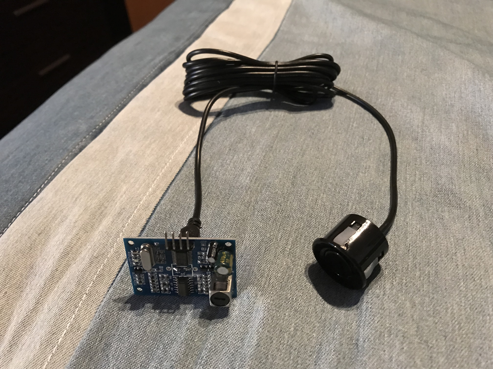

## Raspberry Pi Backup Camera Project

Below is some information on my personal project. Idea behind the project is to create a backup camera with a distance sensor, code it in Python and install it in a vehicle. Various sources were used during this implementation; I will try to list all of them. The project currently in a development state. Project is an entry-level and does not contain any complicated code, anybody can do it.

### Here is a list of parts: 
- CanaKit Raspberry Pi 3 Complete Starter Kit - 32 GB Edition ($69 Amazon)
- Smraza Basic Starter Kit with LCD 1602 (with IIC) for Arduino and Raspberry Pi ($20.59 Amazon)
- Diymore DC 5V Waterproof Ultrasonic Module Distance Measuring Transducer Sensor Module (14.99 Amazon)
- ELP megapixel Super Mini 720p USB Camera Module with 100degree lens ($28.90 Amazon)
- Elegoo 17 Values 1% Resistor Kit Assortment, 0 Ohm-1M Ohm (Pack of 525) ($10.86 Amazon)
- (Need to get) Display

### Getting started:
First of all, after getting my first Raspberry Pi I got all excited to play around with it and create something cool. After watching a lot of videos on the YouTube I decide to make something with a camera. In particular [this project]( http://jeremyblythe.blogspot.co.uk/2013/03/raspberry-pi-parking-camera-with.html) got my attention, and I decide use it as a base. 
	
- First problem I faced was how to stream live video, there are hundreds of ways you can do it, but the one I chose was to use [Pygame]( https://www.pygame.org) Library, due to a simple implementation of a video streaming. I used this [tutorial]( http://www.pygame.org/docs/tut/CameraIntro.html) on a video streaming. 
- Second problem is a distance sensor, first I was going to use IR sensor, but it has small range and only option I had was ultrasound distance sensor. Here is a good [tutorial]( https://tutorials-raspberrypi.com/raspberry-pi-ultrasonic-sensor-hc-sr04/) on how to setup a distance sensor.




### First attempt to make things working: 
After installing all the libraries and the updates for the Sensor and Pygame, I wrote this small program in Python just to try If the whole thing is going to work or not. Here is the code:
```markdown

#
#used as a reference http://www.pygame.org/docs/tut/CameraIntro.html 

#import Pygame files
import time
import os
import pygame
import pygame.camera
from pygame.locals import *
from gpiozero import DistanceSensor
from time import sleep

#set constans
DEVICE = '/dev/video0'
SIZE = (320,240)
BLACK = 0,0,0

#sensor reading
def readSensor(sensor):
	valueList = []            #init the list
	for i in range (0,10):
		valueList.append(sensor.distance*100)
		time.sleep(0.005)
	distance = sum(valueList)/len(valueList)
	return distance

#camera stream function
def cameraStream():
	#Initialize camera
	pygame.init()
	pygame.camera.init()

	#set window size
	display = pygame.display.set_mode((320,400),0)

	#get camera list and selet first camera
	cameraList = pygame.camera.list_cameras()
	if cameraList:
		camera = pygame.camera.Camera(cameraList[0],SIZE)

	#start the camera
	camera.start()

	sensor = DistanceSensor(echo=17, max_distance=3, trigger=4)

	#crate a surface to capture to
	screen = pygame.surface.Surface(SIZE, 0, display)
	
	working = True

	while working:
		display.fill(BLACK)
		#display image
		screen = camera.get_image(screen)
		#blit to the display surface
		display.blit(screen, (0,0))

		dist = readSensor(sensor)
		if  dist > 30:
			time = "MOVE"
		else:
			time = "STOP"

		font_big = pygame.font.Font(None, 50)           # font size
		text_surface = font_big.render('%d cm = %s'%(dist,time),True, (255,150,0))	
		
		rect = text_surface.get_rect(center=(160,350))  # position
		
		display.blit(text_surface, rect)

		pygame.display.flip()
		pygame.display.update()
		events = pygame.event.get()
		for e in events:
			if e.type == QUIT or (e.type == KEYDOWN and e.key == K_ESCAPE):
				#exit
				working = False
	camera.stop()
	pygame.quit()
	return

if __name__ == '__main__':
	cameraStream()

```


# Below is a test info

## Welcome to GitHub Pages

You can use the [editor on GitHub](https://github.com/gzhylin/PiBackUpCam/edit/master/index.md) to maintain and preview the content for your website in Markdown files.

Whenever you commit to this repository, GitHub Pages will run [Jekyll](https://jekyllrb.com/) to rebuild the pages in your site, from the content in your Markdown files.

### Markdown

Markdown is a lightweight and easy-to-use syntax for styling your writing. It includes conventions for

```markdown
Syntax highlighted code block

# Header 1
## Header 2
### Header 3

- Bulleted
- List

1. Numbered
2. List

**Bold** and _Italic_ and `Code` text

[Link](url) and 
```

For more details see [GitHub Flavored Markdown](https://guides.github.com/features/mastering-markdown/).


